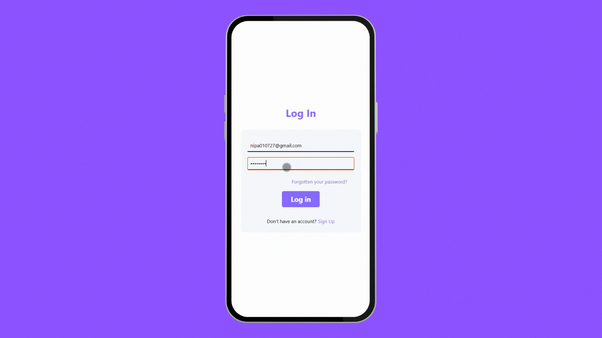

# 📝 ToDoApp

A simple yet functional mobile To-Do List app built with **React Native** and **Expo**.  
The app allows users to **add**, **edit**, **delete**, and **mark tasks as complete**, with **Firebase Authentication** and **Cloud Firestore** for real-time data management.

---

## 🌟 Features

- ✅ User authentication with **Firebase Auth**
- 📋 Create, read, update, and delete tasks (CRUD)
- 🔄 Real-time sync with **Cloud Firestore**
- 📱 Mobile-first UI with a clean, user-friendly design

---

## 🚀 Tech Stack

| Category        | Tools / Services            |
|----------------|-----------------------------|
| **Frontend**    | React Native, JavaScript    |
| **Framework**   | [Expo.dev](https://expo.dev) |
| **Backend**     | Firebase Authentication     |
| **Database**    | Firestore (NoSQL)           |

